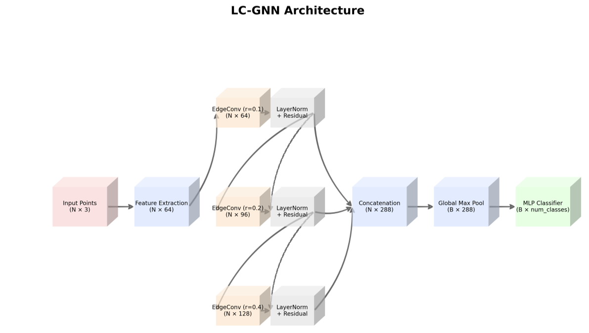
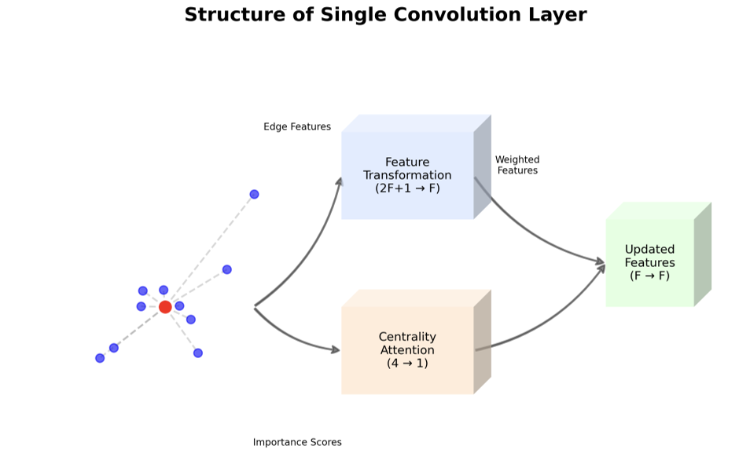
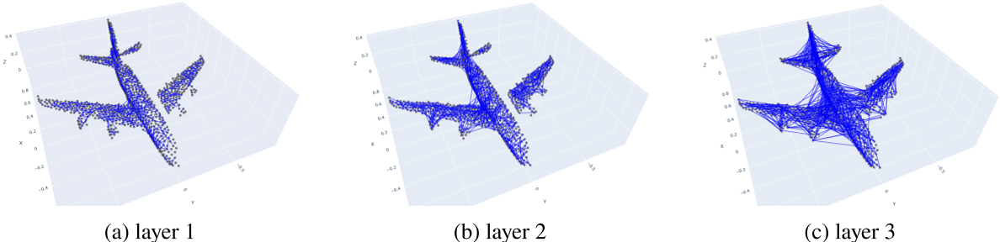
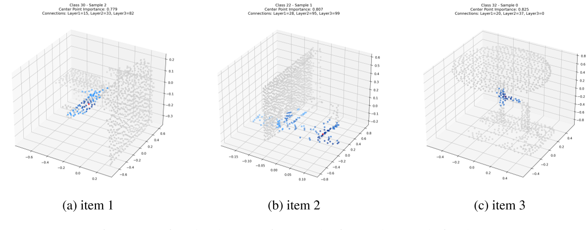

# Exploring the Role of Local Centrality in Graph Neural Networks for Point Cloud Classification

_This is my final thesis project in the advanced course "Pattern Recognition and Machine Learning"_

## Overview
I proposes a lightweight approach to enhance Graph Neural Networks (GNNs) for point cloud classification by integrating efficient local centrality measures. The method achieves **91.2% accuracy on ModelNet40 with only 0.27M parameters**, demonstrating that carefully designed structural feature learning can maintain competitive performance while significantly reducing model complexity.

## Key Contributions

1. **Efficient Local Centrality Computation**
   - Computes weighted local degree centrality within radius-based neighborhoods
   - Avoids expensive global computations with \(\mathcal{O}(N \log N)\) complexity
   - Captures higher-order structural information through recursive formulation

2. **Structural Edge Convolution Layer**
   - Integrates centrality scores into edge feature computation
   - Combines geometric and structural information through adaptive aggregation
   - Prevents over-smoothing while maintaining discriminative features

3. **Parameter-Efficient Architecture**
   - 0.27M parameters vs. 3.5M for PointNet, 1.8M for DGCNN
   - Multi-scale feature extraction with residual connections
   - Progressive receptive field expansion (r = 0.1, 0.2, 0.4)

## Method

### Local Centrality Computation

For a point cloud $P \in \mathbb{R}^{N \times 3}$, the weighted local degree centrality is:

$d_i = \sum_{j \in N_r(i)} w_{ij}$, 
$\quad w_{ij} = \exp(-\Vert p_i - p_j \Vert^2)$ 

To capture higher-order structure, we use a recursive formulation:

$\tilde{d}\_i = d_i + \frac{\alpha}{d_i + \varepsilon} \sum_{j \in N_r(i)} d_j w_{ij}$, 
$\alpha = 0.5$, 
$\varepsilon = 10^{-6}$

### Structural Edge Features

Edge features are computed with centrality weighting:

$e_{ij} = MLP\big(x_i \Vert (x_j - x_i) \Vert \Vert p_i - p_j \Vert^2\big) \cdot s_i$ 

where $s_i$ is the normalized centrality score.

### Adaptive Feature Aggregation

A learnable combination of max and mean pooling:

$x'\_i = w_1 \cdot \max_{j \in N_r(i)} e_{ij} + w_2 \cdot mean_{j \in N_r(i)} e_{ij}$

where $w_1, w_2$ are normalized via softmax.

## Experimental Results

### ModelNet40 Performance

| Method | OA (%) | mAcc (%) | Params (M) |
|--------|--------|----------|------------|
| PointNet | 89.2 | 86.2 | 3.5 |
| PointNet++ | 90.7 | 87.8 | 1.7 |
| **Local-Centrality GCN (Ours)** | **91.2** | **87.9** | **0.27** |

### Ablation Study: Centrality Integration Methods

| Method | OA (%) | Params (M) |
|--------|--------|------------|
| Resconnection GCN | 85.5 | 0.03 |
| Centrality-embedding GCN | 86.9 | 0.04 |
| Large-scale Centrality-embedding | 88.6 | 0.96 |
| Local-Centrality GCN (Ours) | 91.2 | 0.27 |

## Visualization Analysis

### Architecture Overview

_Figure 1: Overview of our centrality-enhanced architecture for point cloud classification_

_Figure 2: Detailed structure of the proposed structural edge convolution layer, showing the integration of geometric features with centrality-based attention and adaptive feature aggregation mechanisms_

### Structural Edge Convolution Layer

_Figure 3: Point cloud connection graph after each convolution layer_

### Connection Graph Evolution

_Figure 4: Single point connection graph after centrality-enhanced architecture_

